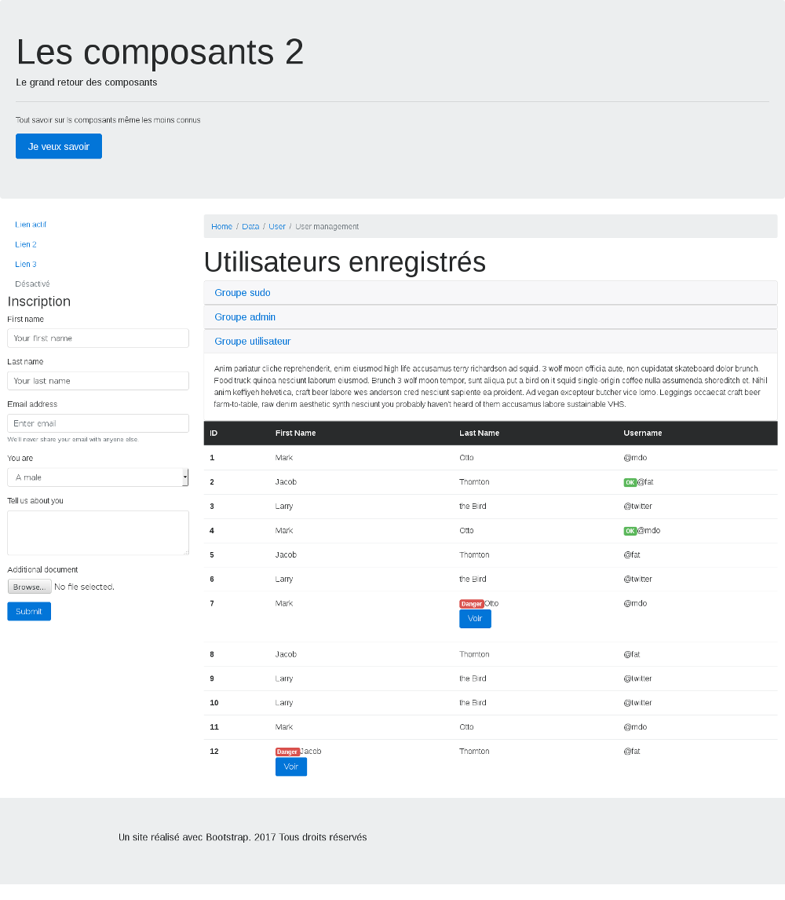

## Composer une page d'administration

Dans cet exercice, vous allez apprendre à composer une page comme on peut en trouver sur les espaces d'administration des sites internet, uniquement avec des composants Bootstrap.

Votre page comportera les éléments suivants :

- un header

- un aside contenant une navigation et un formulaire pour inscrire des utilisateurs

- une zone pour le contenu principal avec un fil d'arianne, un accordéon qui affiche des informations sur les différents groupes utilisateurs au clique et un tableau listant les différents utilisateurs.

- Dans ce tableau certains utilisateurs auront un badge vert ok et un badge rouge danger. Sur les utilisateurs avec un badge danger, un bouton affichera un texte au clique.

- un footer

Votre résultat devrait ressembler à ceci :



## Correction

```
<div class="jumbotron">
          <h1 class="display-3">Les composants 2</h1>
          <p class="lead">Le grand retour des composants</p>
          <hr class="my-4">
          <p>Tout savoir sur ls composants même les moins connus</p>
          <p class="lead">
            <a class="btn btn-primary btn-lg" href="#" role="button">Je veux savoir</a>
          </p>
        </div>


        <!-- Start of the main container -->

        <div class="container-fluid">

<!-- Main content -->

          <div class="row">
              <div class="col-12 col-md-3">
                <!-- Nav -->
                <ul class="nav flex-column">
                  <li class="nav-item">
                    <a class="nav-link active" href="#">Lien actif</a>
                  </li>
                  <li class="nav-item">
                    <a class="nav-link" href="#">Lien 2</a>
                  </li>
                  <li class="nav-item">
                    <a class="nav-link" href="#">Lien 3</a>
                  </li>
                  <li class="nav-item">
                    <a class="nav-link disabled" href="#">Désactivé</a>
                  </li>
                </ul>

                <!-- Form -->

                <h3 class="display-5">Inscription</h3>
                <form>
                  <div class="form-group">

                    <label for="example-text-input">First name</label>
                    <input class="form-control" type="text" value="Your first name" id="example-text-input">
                  </div>

                  <div class="form-group">
                    <label for="example-text-input">Last name</label>
                    <input class="form-control" type="text" value="Your last name" id="example-text-input">
                  </div>
                  <div class="form-group">
                    <label for="exampleInputEmail1">Email address</label>
                    <input type="email" class="form-control" id="exampleInputEmail1" aria-describedby="emailHelp" placeholder="Enter email">
                    <small id="emailHelp" class="form-text text-muted">We'll never share your email with anyone else.</small>
                  </div>

                  <div class="form-group">
                    <label for="exampleSelect1">You are</label>
                    <select class="form-control" id="exampleSelect1">
                      <option>A male</option>
                      <option>A female</option>
                    </select>
                  </div>
                  <div class="form-group">
                    <label for="exampleTextarea">Tell us about you</label>
                    <textarea class="form-control" id="exampleTextarea" rows="3"></textarea>
                  </div>
                  <div class="form-group">
                    <label for="exampleInputFile">Additional document</label>
                    <input type="file" class="form-control-file" id="exampleInputFile" aria-describedby="fileHelp">
                  </div>

                  <button type="submit" class="btn btn-primary">Submit</button>
                </form>
            </div>

<!-- Table content -->
            <div class="col-12 col-md-9">
              <nav class="breadcrumb">
                <a class="breadcrumb-item" href="#">Home</a>
                <a class="breadcrumb-item" href="#">Data</a>
                <a class="breadcrumb-item" href="#">User</a>
                <span class="breadcrumb-item active">User management</span>
              </nav>
              <h2 class="display-4">Utilisateurs enregistrés</h2>

              <div id="accordion" role="tablist" aria-multiselectable="true">
                <div class="card">
                  <div class="card-header" role="tab" id="headingOne">
                    <h5 class="mb-0">
                      <a data-toggle="collapse" data-parent="#accordion" href="#collapseOne" aria-expanded="true" aria-controls="collapseOne">
                        Groupe sudo
                      </a>
                    </h5>
                  </div>

                  <div id="collapseOne" class="collapse show" role="tabpanel" aria-labelledby="headingOne">
                    <div class="card-block">
                      Anim pariatur cliche reprehenderit, enim eiusmod high life accusamus terry richardson ad squid. 3 wolf moon officia aute, non cupidatat skateboard dolor brunch. Food truck quinoa nesciunt laborum eiusmod. Brunch 3 wolf moon tempor, sunt aliqua put a bird on it squid single-origin coffee nulla assumenda shoreditch et. Nihil anim keffiyeh helvetica, craft beer labore wes anderson cred nesciunt sapiente ea proident. Ad vegan excepteur butcher vice lomo. Leggings occaecat craft beer farm-to-table, raw denim aesthetic synth nesciunt you probably haven't heard of them accusamus labore sustainable VHS.
                    </div>
                  </div>
                </div>
                <div class="card">
                  <div class="card-header" role="tab" id="headingTwo">
                    <h5 class="mb-0">
                      <a class="collapsed" data-toggle="collapse" data-parent="#accordion" href="#collapseTwo" aria-expanded="false" aria-controls="collapseTwo">
                        Groupe admin
                      </a>
                    </h5>
                  </div>
                  <div id="collapseTwo" class="collapse" role="tabpanel" aria-labelledby="headingTwo">
                    <div class="card-block">
                      Anim pariatur cliche reprehenderit, enim eiusmod high life accusamus terry richardson ad squid. 3 wolf moon officia aute, non cupidatat skateboard dolor brunch. Food truck quinoa nesciunt laborum eiusmod. Brunch 3 wolf moon tempor, sunt aliqua put a bird on it squid single-origin coffee nulla assumenda shoreditch et. Nihil anim keffiyeh helvetica, craft beer labore wes anderson cred nesciunt sapiente ea proident. Ad vegan excepteur butcher vice lomo. Leggings occaecat craft beer farm-to-table, raw denim aesthetic synth nesciunt you probably haven't heard of them accusamus labore sustainable VHS.
                    </div>
                  </div>
                </div>
                <div class="card">
                  <div class="card-header" role="tab" id="headingThree">
                    <h5 class="mb-0">
                      <a class="collapsed" data-toggle="collapse" data-parent="#accordion" href="#collapseThree" aria-expanded="false" aria-controls="collapseThree">
                        Groupe utilisateur
                      </a>
                    </h5>
                  </div>
                  <div id="collapseThree" class="collapse" role="tabpanel" aria-labelledby="headingThree">
                    <div class="card-block">
                      Anim pariatur cliche reprehenderit, enim eiusmod high life accusamus terry richardson ad squid. 3 wolf moon officia aute, non cupidatat skateboard dolor brunch. Food truck quinoa nesciunt laborum eiusmod. Brunch 3 wolf moon tempor, sunt aliqua put a bird on it squid single-origin coffee nulla assumenda shoreditch et. Nihil anim keffiyeh helvetica, craft beer labore wes anderson cred nesciunt sapiente ea proident. Ad vegan excepteur butcher vice lomo. Leggings occaecat craft beer farm-to-table, raw denim aesthetic synth nesciunt you probably haven't heard of them accusamus labore sustainable VHS.
                    </div>
                  </div>
                </div>
              </div>

              <table class="table">
                <thead class="thead-inverse">
                  <tr>
                    <th>ID</th>
                    <th>First Name</th>
                    <th>Last Name</th>
                    <th>Username</th>
                  </tr>
                </thead>
                <tbody>
                  <tr>
                    <th scope="row">1</th>
                    <td>Mark</td>
                    <td>Otto</td>
                    <td>@mdo</td>
                  </tr>
                  <tr>
                    <th scope="row">2</th>
                    <td>Jacob</td>
                    <td>Thornton</td>
                    <td><span class="badge badge-success">OK</span>@fat</td>
                  </tr>
                  <tr>
                    <th scope="row">3</th>
                    <td>Larry</td>
                    <td>the Bird</td>
                    <td>@twitter</td>
                  </tr>
                  <tr>
                    <th scope="row">4</th>
                    <td>Mark</td>
                    <td>Otto</td>
                    <td><span class="badge badge-success">OK</span>@mdo</td>
                  </tr>
                  <tr>
                    <th scope="row">5</th>
                    <td>Jacob</td>
                    <td>Thornton</td>
                    <td>@fat</td>
                  </tr>
                  <tr>
                    <th scope="row">6</th>
                    <td>Larry</td>
                    <td>the Bird</td>
                    <td>@twitter</td>
                  </tr>
                  <tr>
                    <th scope="row">7</th>
                    <td>Mark</td>
                    <td><span class="badge badge-danger">Danger</span>Otto
                      <p>
                        <button class="btn btn-primary" type="button" data-toggle="collapse" data-target="#collapseExample" aria-expanded="false" aria-controls="collapseExample">
                          Voir
                        </button>
                      </p>
                      <div class="collapse" id="collapseExample">
                        <div class="card card-block">
                          Le profil de cet utilisateur a été détecté comme dangeureux, assurez-vous qu'il ne représente aucun risque avant de poursuivre
                        </div>
                      </div>
                    </td>
                    <td>@mdo</td>
                  </tr>
                  <tr>
                    <th scope="row">8</th>
                    <td>Jacob</td>
                    <td>Thornton</td>
                    <td>@fat</td>
                  </tr>
                  <tr>
                    <th scope="row">9</th>
                    <td>Larry</td>
                    <td>the Bird</td>
                    <td>@twitter</td>
                  </tr>
                  <tr>
                    <th scope="row">10</th>
                    <td>Larry</td>
                    <td>the Bird</td>
                    <td>@twitter</td>
                  </tr>
                  <tr>
                    <th scope="row">11</th>
                    <td>Mark</td>
                    <td>Otto</td>
                    <td>@mdo</td>
                  </tr>
                  <tr>
                    <th scope="row">12</th>
                    <td><span class="badge badge-danger">Danger</span>Jacob
                      <p>
                        <button class="btn btn-primary" type="button" data-toggle="collapse" data-target="#collapseExample2" aria-expanded="false" aria-controls="collapseExample">
                          Voir
                        </button>
                      </p>
                      <div class="collapse" id="collapseExample2">
                        <div class="card card-block">
                          Le profil de cet utilisateur a été détecté comme dangeureux, assurez-vous qu'il ne représente aucun risque avant de poursuivre
                        </div>
                      </div>
                    </td>
                    <td>Thornton</td>
                    <td>@fat</td>
                  </tr>
                </tbody>
              </table>
            </div>

          </div>
        </div>

        <!-- Footer -->

        <footer class="jumbotron jumbotron-fluid">
          <div class="container">
            <p class="lead">Un site réalisé avec Bootstrap. 2017 Tous droits réservés</p>
          </div>
        </footer>

```
