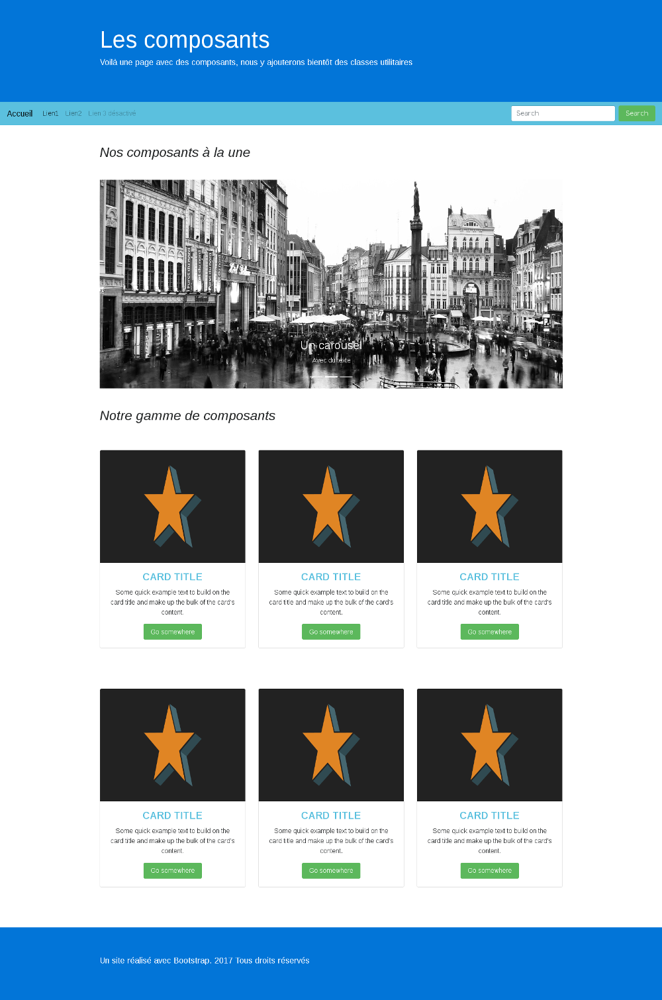

## Donnez du style à vos créations

Pour cet exercice, vous allez reprendre le code que vous avez produit dans l'exercice sur les composants et nous allons améliorer le rendu visuel.

Contentez-vous simplement de rajouter deux titres ```<h2>```, un pour votre carrousel et un pour vos cartes.

Autrement-dit, vous n'utiliserez que des classes utilitaires, c'est-à-dire que vous ne ferez que rajouter des classes sur vos éléments HTML et rien d'autre.

Vous allez devoir entre autres choses :

- Changer les couleurs du header et du footer

- Changer la couleur de la nav et du boutton

- Faire en sorte que votre design soit complètement responsive

- Masquer le slider sur mobile

- Gérer la taille de vos titres

- Passer les deux titres que vous avez rajoutés en italique

- Passer le bouton des cartes en vert

- Passer le titre des cartes en capitales, en gras et changer sa couleur

- Aligner le texte des cartes au centre

- Adapter la couleur du footer

Voici le résultat que vous devez essayer d'obtenir :



## Correction

```

<!-- Start of the jumbotron -->

        <header class="jumbotron jumbotron-fluid bg-primary text-white mb-0">
          <section class="container">
            <h1 class="display-4">Les composants</h1>
            <p class="lead">Voilà une page avec des composants, nous y ajouterons bientôt des classes utilitaires</p>
          </section>
        </header>


        <!-- Start of the navbar -->

        <nav class="navbar navbar-toggleable-md navbar-light bg-faded mb-5 bg-info text-white">
          <button class="navbar-toggler navbar-toggler-right" type="button" data-toggle="collapse" data-target="#navbarSupportedContent" aria-controls="navbarSupportedContent" aria-expanded="false" aria-label="Toggle navigation">
            <span class="navbar-toggler-icon"></span>
          </button>
          <a class="navbar-brand" href="#">Accueil</a>

          <div class="collapse navbar-collapse" id="navbarSupportedContent">
            <ul class="navbar-nav mr-auto">
              <li class="nav-item active">
                <a class="nav-link" href="#">Lien1<span class="sr-only">(current)</span></a>
              </li>
              <li class="nav-item">
                <a class="nav-link" href="#">Lien2</a>
              </li>
              <li class="nav-item">
                <a class="nav-link disabled" href="#">Lien 3 désactivé</a>
              </li>
            </ul>
            <form class="form-inline my-2 my-lg-0">
              <input class="form-control mr-sm-2" type="text" placeholder="Search">
              <button class="btn bg-success text-white my-2 my-sm-0" type="submit">Search</button>
            </form>
          </div>
        </nav>

        <!-- Start of the main container -->

        <div class="container">

          <h2 class="mb-5 hidden-xs-down font-italic">Nos composants à la une</h2>

<!-- Slider -->

          <div id="carouselExampleIndicators" class="carousel slide mb-5 hidden-xs-down" data-ride="carousel">
            <ol class="carousel-indicators">
              <li data-target="#carouselExampleIndicators" data-slide-to="0" class="active"></li>
              <li data-target="#carouselExampleIndicators" data-slide-to="1"></li>
              <li data-target="#carouselExampleIndicators" data-slide-to="2"></li>
            </ol>
            <div class="carousel-inner" role="listbox">
              <div class="carousel-item active">
                
                <section class="carousel-caption d-none d-md-block">
                  <h3>Un carousel</h3>
                  <p>Avec du texte</p>
                </section>
              </div>
              <div class="carousel-item">
                
                <section class="carousel-caption d-none d-md-block">
                  <h3>Un carousel</h3>
                  <p>Avec du texte</p>
                </section>
              </div>
              <div class="carousel-item">
                
                <section class="carousel-caption d-none d-md-block">
                  <h3>Un carousel</h3>
                  <p>Avec du texte</p>
                </section>
              </div>
            </div>
            <a class="carousel-control-prev" href="#carouselExampleIndicators" role="button" data-slide="prev">
              <span class="carousel-control-prev-icon" aria-hidden="true"></span>
              <span class="sr-only">Previous</span>
            </a>
            <a class="carousel-control-next" href="#carouselExampleIndicators" role="button" data-slide="next">
              <span class="carousel-control-next-icon" aria-hidden="true"></span>
              <span class="sr-only">Next</span>
            </a>
          </div>

<!-- Card content -->

          <h2 class="mb-3 font-italic">Notre gamme de composants</h2>

          <div class="row mb-5">
            <div class="col-12 col-md-6 col-lg-4 my-5">
              <article class="card">
                
                <div class="card-block text-center">
                  <h4 class="card-title text-info text-uppercase font-weight-bold">Card title</h4>
                  <p class="card-text">Some quick example text to build on the card title and make up the bulk of the card's content.</p>
                  <a href="#" class="btn btn-success">Go somewhere</a>
                </div>
              </article>
            </div>
            <div class="col-12 col-md-6 col-lg-4 my-5">
              <article class="card">
                
                <div class="card-block text-center">
                  <h4 class="card-title text-info text-uppercase font-weight-bold">Card title</h4>
                  <p class="card-text">Some quick example text to build on the card title and make up the bulk of the card's content.</p>
                  <a href="#" class="btn btn-success">Go somewhere</a>
                </div>
              </article>
            </div>
            <div class="col-12 col-md-6 col-lg-4 my-5">
              <article class="card">
                
                <div class="card-block text-center">
                  <h4 class="card-title text-info text-uppercase font-weight-bold">Card title</h4>
                  <p class="card-text">Some quick example text to build on the card title and make up the bulk of the card's content.</p>
                  <a href="#" class="btn btn-success">Go somewhere</a>
                </div>
              </article>
            </div>

            <div class="col-12 col-md-6 col-lg-4 my-5">
              <article class="card">
                
                <div class="card-block text-center">
                  <h4 class="card-title text-info text-uppercase font-weight-bold">Card title</h4>
                  <p class="card-text">Some quick example text to build on the card title and make up the bulk of the card's content.</p>
                  <a href="#" class="btn btn-success">Go somewhere</a>
                </div>
              </article>
            </div>
            <div class="col-12 col-md-6 col-lg-4 my-5">
              <article class="card">
                
                <div class="card-block text-center">
                  <h4 class="card-title text-info text-uppercase font-weight-bold">Card title</h4>
                  <p class="card-text">Some quick example text to build on the card title and make up the bulk of the card's content.</p>
                  <a href="#" class="btn btn-success">Go somewhere</a>
                </div>
              </article>
            </div>
            <div class="col-12 col-md-6 col-lg-4 my-5">
              <article class="card">
                
                <div class="card-block text-center">
                  <h4 class="card-title text-info text-uppercase font-weight-bold">Card title</h4>
                  <p class="card-text">Some quick example text to build on the card title and make up the bulk of the card's content.</p>
                  <a href="#" class="btn btn-success">Go somewhere</a>
                </div>
              </article>
            </div>

          </div>
        </div>

        <!-- Footer -->

        <footer class="jumbotron jumbotron-fluid mb-0 bg-primary text-white">
          <div class="container">
            <p class="lead">Un site réalisé avec Bootstrap. 2017 Tous droits réservés</p>
          </div>
        </footer>

```
