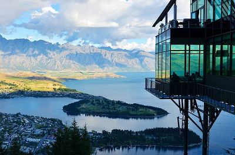

# Consigne

Le positionnement en CSS ! Tout un monde, tant de méthodes, tant de pratiques. La seule manière de vous sentir à l'aise quand vous disposez vos éléments sur votre page c'est de pratiquer.

Nous allons réaliser ensemble un nouveau modèle de page, lui aussi assez classique mais quelque peu différent du précédent.

Votre squelette HTML comportera les éléments suivants :

- Un header avec une image et un titre de premier niveau

- Un article qui comportera un titre de deuxième niveau, une image positionnée à droite et deux paragraphes.

- Un titre de niveau trois et trois miniatures symbolisant d'autres articles.

Toutes les images vous sont fournies, votre objectif est de vous rapprocher le plus possible du résultat suivant, bien-sûr vous êtes libre dans votre choix de couleurs !


# Correction

index.html

```
<!DOCTYPE html>
<html>
  <head>
    <meta charset="utf-8">
    <title>Positionnement bis</title>
  </head>
  <link rel="stylesheet" href="style.css">
  <body>

    <header>
      <figure>
        
      </figure>
      <h1>Titre de premier niveau</h1>
    </header>

    <section>
      <article>
        <h2>Des news super importantes</h2>
        <figure>
          
        </figure>
        <p>Lorem ipsum dolor sit amet, consectetur adipiscing elit. Integer non nisi aliquet, venenatis ex at, scelerisque diam. Duis lorem tellus, finibus sed pretium vitae, fringilla sagittis augue. Integer facilisis lorem in arcu iaculis molestie. Phasellus pellentesque ipsum vitae odio hendrerit consequat. Aliquam vel turpis sed lorem sollicitudin placerat. Aenean mollis vel ante in commodo. Maecenas in dolor magna. Quisque porta tempus nulla non euismod.
        Lorem ipsum dolor sit amet, consectetur adipiscing elit. Integer non nisi aliquet, venenatis ex at, scelerisque diam. Duis lorem tellus, finibus sed pretium vitae, fringilla sagittis augue. Integer facilisis lorem in arcu iaculis molestie. Phasellus pellentesque ipsum vitae odio hendrerit consequat. Aliquam vel turpis sed lorem sollicitudin placerat. Aenean mollis vel ante in commodo. Maecenas in dolor magna. Quisque porta tempus nulla non euismod. </p>
        <p>Lorem ipsum dolor sit amet, consectetur adipiscing elit. Integer non nisi aliquet, venenatis ex at, scelerisque diam. Duis lorem tellus, finibus sed pretium vitae, fringilla sagittis augue. Integer facilisis lorem in arcu iaculis molestie. Phasellus pellentesque ipsum vitae odio hendrerit consequat. Aliquam vel turpis sed lorem sollicitudin placerat. Aenean mollis vel ante in commodo. Maecenas in dolor magna. Quisque porta tempus nulla non euismod.
        Lorem ipsum dolor sit amet, consectetur adipiscing elit. Integer non nisi aliquet, venenatis ex at, scelerisque diam. Duis lorem tellus, finibus sed pretium vitae, fringilla sagittis augue. Integer facilisis lorem in arcu iaculis molestie. Phasellus pellentesque ipsum vitae odio hendrerit consequat. Aliquam vel turpis sed lorem sollicitudin placerat. Aenean mollis vel ante in commodo. Maecenas in dolor magna. Quisque porta tempus nulla non euismod. </p>
      </article>

      <h3>Les derniers articles</h3>
      <figure class="news">
        
      </figure>
      <figure class="news">
        
      </figure>
      <figure class="news">
        
      </figure>
    </section>

  </body>
</html>

```

style.css

```
body {
  margin: 0;
}

header {
  margin-bottom: 3em;
  background-color: #e4fde1;
  color: #648381;
}

header h1 {
  margin-left: 5em;
}

header img {
  width: 60%;
}

header figure, h1, .news {
  display: inline-block;
  vertical-align: middle;
}

h2 {
  font-style: italic;
}

h3 {
  text-decoration: underline;
}

section {
  width: 70%;
  margin: auto;
  padding: 1em;
  background-color: #fcfcfc;
}

article img {
  float: right;
}

.news img {
  height: 200px;
  width: 200px;
  margin: 0 2.5em;
}

```
